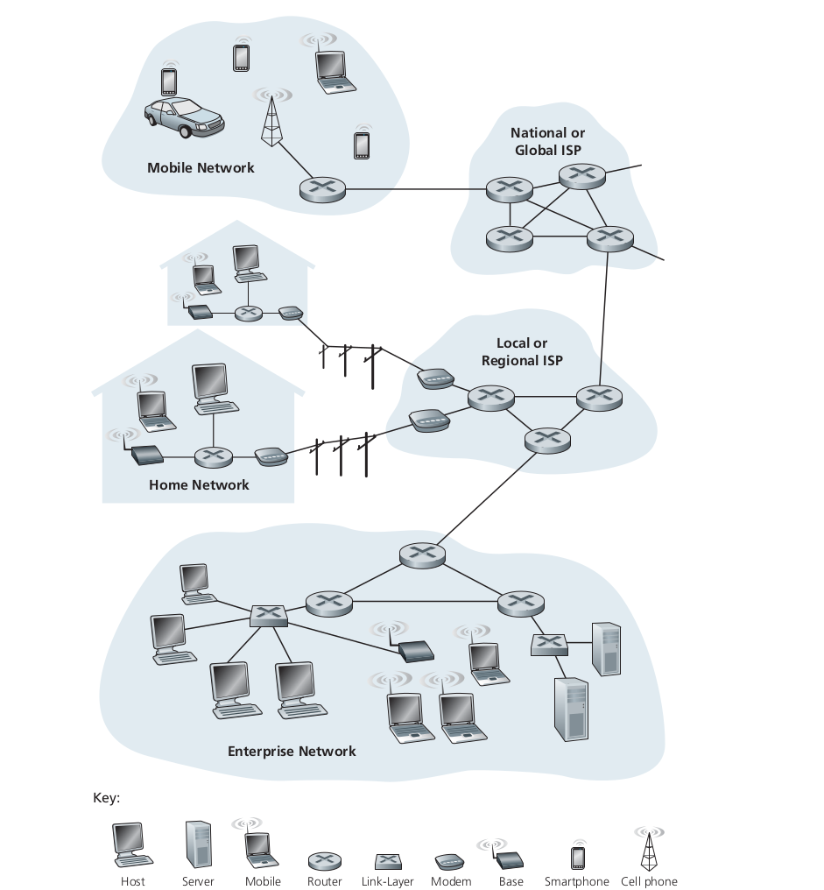

## Foreword

The Internet, one of the greatest engineering feats ever created mankind that connects hundreds of millions of people around the globe to communicate, through smartphones, laptops, smartphones etc. Even now its potential is endless. Its importance in our day-to-day life is inexpressible.

If you take an example, earlier in the morning we would wake up and go outside and pick up the newspaper and then read it. But now all the information that happens around the world is in just a finger click away. Yes! it has become this powerful.

So my purpose of this blog series is to get to understand and learn the historical, conceptual and the technical side of Computer Networks and write down different things that intrigued me and make book notes where I can look back on. The resource I am going to refer is Computer Networking - A Top-Down Approach by Kurose | Ross
[here](https://eclass.teicrete.gr/modules/document/file.php/TP326/%CE%98%CE%B5%CF%89%CF%81%CE%AF%CE%B1%20(Lectures)/Computer_Networking_A_Top-Down_Approach.pdf).

## What is Internet?

The most basic and straightforward explanation is its computer network which interconnects millions of other computer devices throughout the world. Initially, it was just the PCs, Linux workstations or so called servers that stored and transmitted data into simple web pages and mails. But later as time passed, products like laptop, smartphones, TVs, automobiles etc got connected to the internet, and they came to be known as the host or end systems.

These end systems are connected to the network by communication link and packet switches. These links could be physical cables like - coaxial cables, copper wire, fibre optics etc. Different mediums have different transmission rates. Packets,  this is one of the most basic things that we need to understand. It's basically a piece of data that gets transferred through the network to the destination. Then comes a packet switch which utilises the so called packets.

## Packet Switching

By definition it will transmit data across the network, by breaking it down into small blocks or packets for an efficient transfer of data through different network devices. So let's take an example,

say that we want to send a file from one device to another, the file data gets broken down into small packets, which are independent and each take the best route to the destination.

There are two types of packet switching:

1. connectionless switching
2. connection oriented switching

Now our end system needs access to the internet, so they gain the help of Internet Service Providers(ISP) to achieve this. ISPs can be our local telephone companies, corporate ISPs or any other infrastructure which provides them. ISP in essence is just packet switching and links. The end system, packet switches and other components of the Internet uses protocols. 

The ones we are most familiar with are the Transmission Control Protocol (TCP) and Internet Protocol(IP). They are not just the common ones but also the most important protocols on the Internet. Why do we need protocols? Simple enough it's because of the vast size of it and how complex it is, we can't imagine it. So need some basic ground rules that each device needs to follow for transfer of information in both software and hardware level.

## As a Service 

We just went through certain aspect of internet, but we might be thinking, in the bigger picture what else could it do? So that's where it broadens our spectrum of the Internet. So we can think of the internet as an infrastructure that provides service to applications. These applications can do anything from emails, social networks, video streaming etc, and they are called distributed applications. This is called so because there are different end systems involved. 

But here an issue arises, since an application is running on an end system, you need to write programs to run these applications and they can be in say C, Java or Python. Now since I said we are using distributed internet applications, we need to send data between end systems.So question lies, how does a program running on one end system instruct the internet to deliver to another program running on another end system?

This is basically like how two people who speak two different languages find it difficult to communication. So whats the solution? We need a middle man or a translator. That's were Application Programming Interface(API) comes in.

## API

So let's say we have a software and that needs to send data to another software. So the software that requires data from the other one, calls its API which defines how the data should be provided. Then this software returns the data to the former application. So API is a set of rules that a sending program must follow so that the internet can deliver specific data to the destination program. So the destination program can only ask for data within those specifications or rules. Thus providing data abstraction. We will look into detail about API later into the series.

So in this blog we looked at the introduction into the Internet, how it has changed our lives and is still progressing exponentially. The basic components and terminologies and API. In the next blog we will look into networks a bit deeper. We will look into the different networks and protocols, the physical media, which will be covered superficially. Then we will jump into the core of Networks.
