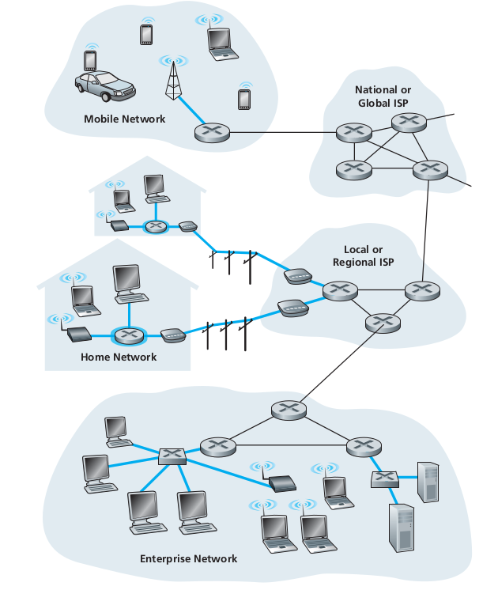
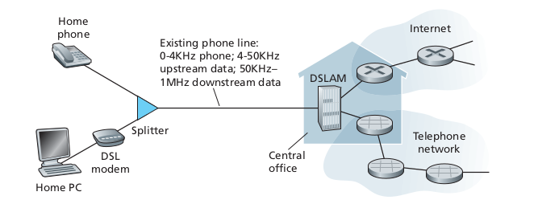

## Foreword

In this part of the blog, I will be going into few concepts that are essential when you dive into networking, Mainly what is protocols, then we will look into briefly the components, physical components of the Internet. 

### What is a Protocol?

In the world of computer networking, one of the recurring and most common term we first familiarise with is protocols. So what are they? Well in the most basic terms they are just certain rules that need to be followed. But why the need? that too is pretty straightforward. Let's imagine a world where there is no law or order, then what would the state of the world be? we can only imagine the chaos the worlds will be in. So in the same way Internet needs protocols for smooth functioning.

----

For a human analogy, Say I was walking down a street and a stranger comes and says "HI". So as a civilised human being my first response will also be "HI". After establishing a greeting, the stranger will ask away another query and to that, I might respond to it. So this transfer of messages is the heart of what protocols are. And this is the basic form of communication on the Internet.

### Network Components

Now let's look into how all these connection across countries and continents are established. Well, there have to be some devices sending signals and some devices receiving them. Recall that in the previous part of the blog we discussed that the devices connected to the internet are often referred to as end-systems or hosts. They are called host because they are the ones that host the web browser program. 

Now in basic level they are of two types, namely clients and servers.

Clients, they are those what we generally use in our day-to-day life. Like smartphones, desktops, laptops etc. While the servers are more powerful machines, that stores a huge amount of data(videos, images, web pages, ...).

In current terms they are referred to as Data centers. 


https://blogs.synopsys.com/from-silicon-to-software/files/2021/01/Hyperscale-Data-Center-1024x576.jpg
https://3er1viui9wo30pkxh1v2nh4w-wpengine.netdna-ssl.com/wp-content/uploads/2016/11/RP1371_CDC_Wyoming_02-1024x576.jpg



### Access Networks

Considering that the  applications and end-systems are the "edge of network", then the access network will be the network that physically connects the hosts to first router(edge router) then to some distant host.

There are thee type of access networks:
1. Home access
2. Enterprise access
3. Wide-area access

### Home Access

Today, the most prevalent types of broadband residential access are Digital Subscriber Line(DSL) and cable. The DSL acquires its internet from the local telephone company, that provides its wired telephone access. This is what we refer to as ISP.

Now the Cable Internet Access makes use of the cable television company's existing cable TV infrastructure. Today, mostly the cables have been changed to fibre optics which provides more transmission rate. Now if you are one of those who use (CIA), you might have seen the modem, these cable internet access requires it.

### Enterprise Access

When it comes to enterprise-level infrastructure, say a building, all the end-systems are connected, this forms the Local Area Network(LAN). There are many types of LAN technologies, but for simplicity sake let's stay with Ethernet. Ethernet does use twisted-pair copper wire, but lately, the trend has shifted to wireless technology.

---

### Wide-Area Wireless Access

As we know wireless communication and technology has become the norm. All the new smartphones are utilising this technology to send messages, share videos, watch Netflix etc. But unlike the WiFi, which has the limitation of distance, using this the user need only be few tens of kilometres from the station. And with this every human need is now just a finger touch away, and that is no exaggeration.

There are large investments in the wireless technology, ie 4G, 5G. In the near future we can witness many new innovation brought to us from this.

## Conclusion

We discussed about the different components and some important concepts that we need to understand before nose diving into deeper levels of computer networks. Next part we will go deeper into the core of networks.